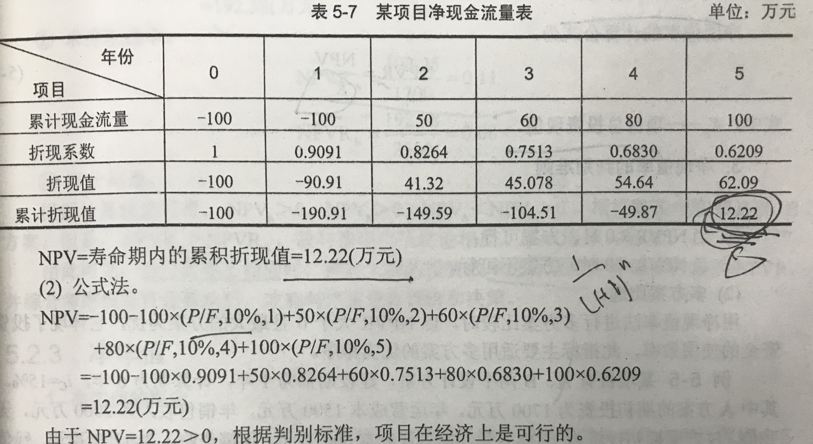
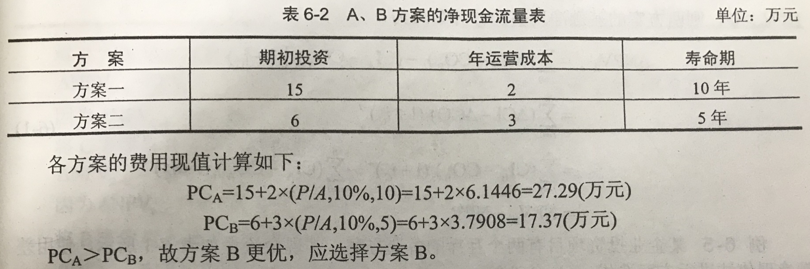

# 考点
## 第二章 工程经济评价基本要素
+ **投资估算**
	+ 对于固定资产
		1. 单位生产能力估算法:相近规模的单位生产能力
		2. 生产能力指数法：已建成项目的投资额或其设备投资额
		3. 系数估算法:
		4. 比例估算法:出现比例
		5. 指标估算法:存在设备单价
	+ 对于流动资产
		1. 扩大指标估算法
		2. 分项详细估算法
+ **固定资产投资**:建筑安装工程费、设备工器具购置费、其他费用、预备费、建设期利息
+ **流动资产投资**
+ **半变动成本**:有一个初量，随产量的增长而增长。
+ **半固定成本**:产量在一定限度内不改变成本。
+ **机会成本**:多个选择时，被放弃的但是价值最高的方案。
+ **沉没成本**:不会因为现在或将来决策改变的成本。
+ **税金**:流转税类、所得税类、资源税类、特定目的税类、财产和行为税类。
	1. 流转税类:增值税、消费税、营业税、关税。
	2. 资源税类:资源税、城镇土地使用税。
	3. 特定目的税类:城市维护建设税、土地增值税、车辆购置税、耕地占用税。

## 第三章 工程项目经济预测
> **历史类推法、电话调查**两种方法都属于。
+ 定性分析
	1. 市场调查法
		+ 留置问卷调查法
		+ 预购测算发
		+ 用户调查法
		+ 典型调查法
		+ 展销调查法
	2. 德尔菲法
+ 定量分析
	1. 时间序列预测法
		+ 简单算法平均法
		+ 移动平均法
		+ 指数平滑法
	2. 因果关系分析法
## 第四章 资金的时间价值
> 复利系数中:$(A/P,i,n)=(A/F,i,n)+i$
+ 衡量资金时间价值的**绝对尺度**:利润、利息;**相对尺度**:利率、利润率、利税率。
+ |名称|公式|
  |:---:|:---:|
  |终值公式|(F/P,i,n)|
  |现值公式|(P/F,i,n)|
  |年金终值公式|(F/A,i,n)|
  |偿债基金公式|(A/F,i,n)|
  |现值公式|(P/A,i,n)|
  |资金回收公式|(A/P,i,n)|
+ 名义利率:$R=i*m$
  实际利率:$R=(1+i)^n-1$

## 第五章 工程经济评价基本方法
+ 净现值(NPV)基本算法
  净现值率:$NPVR=NPV/项目总投资$
+ 线性内插法公式:$IRR=i_1+(i_2-i_1)*NPV_1/(NPV_1+NPV_2)$

## 第六章 多方案经济评价方法
+ 寿命期相同的互斥方案
	1. 净现值法
	2. 净年值法
	3. 最小费用法

	4. 差额净现值法
