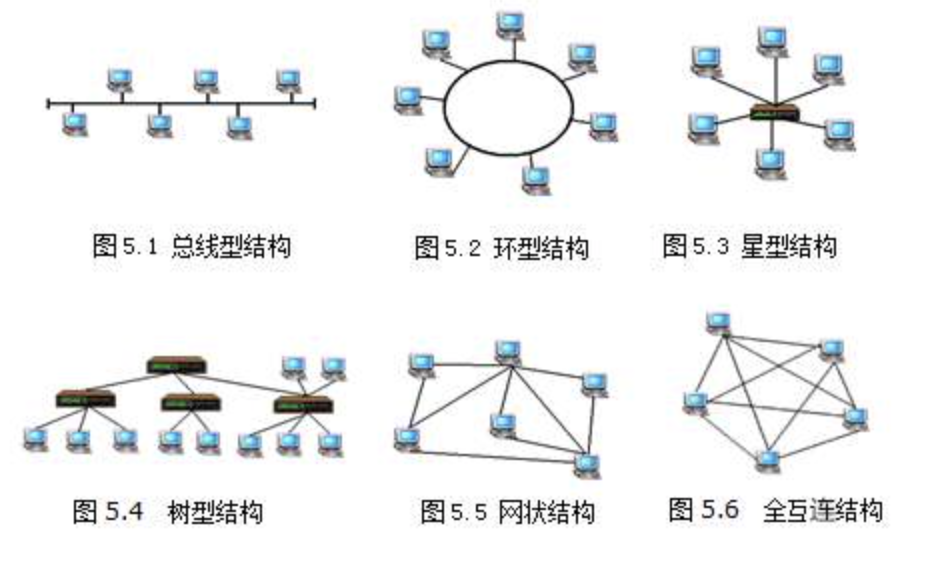
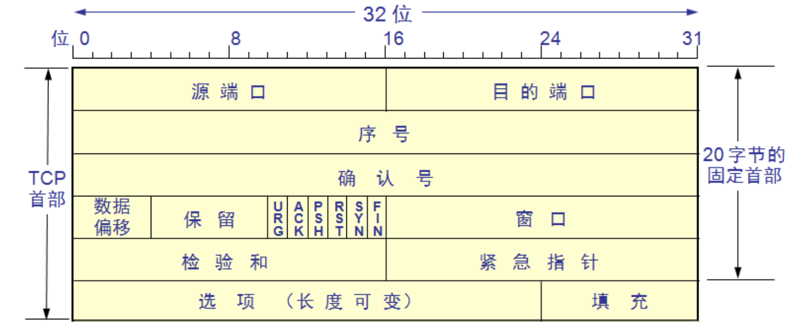
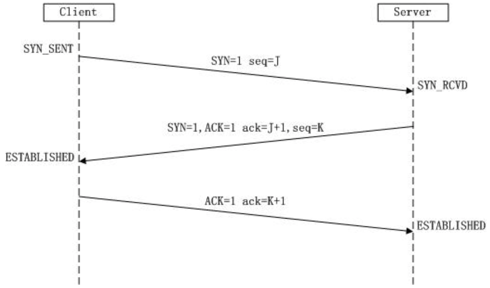
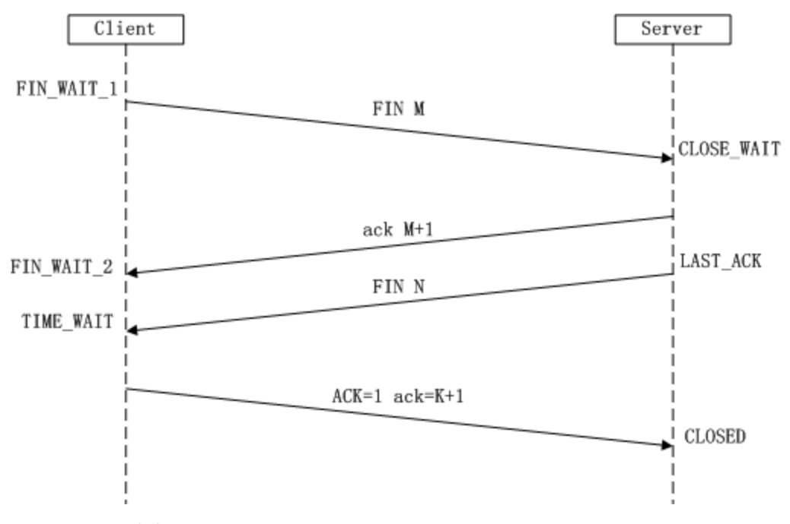
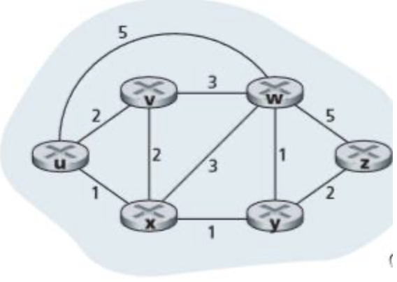
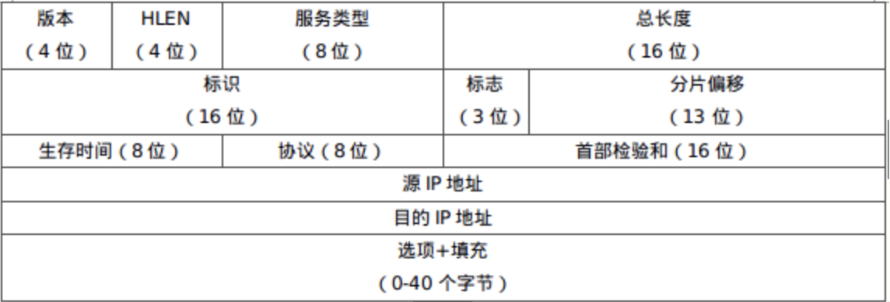

> 世界上第一个计算机网络 —— **ARPANET**
# 计算机网络概述
| OSI模型 | 数据 |
|:---:|:---:|
|应用层| 报文 |
|表示层| 报文 |
|会话层| 报文 |
|运输层| 报文 |
|网络层| 分组 |
|数据链路层| 帧 |
|物理层| 比特 |

> TCP/IP模型可分为5层或者4层，4层时是将数据链路层和物理层合并成为网络接口层。
> 
> + FTP基于TCP协议，TFTP基于UDP协议。

|TCP/IP模型 | 协议 | 数据 | 网络设备|
|:--:|:--:|:--:|:--:|
|应用层|HTTP(超文本传输)、FTP(文件传输)、SMTP(简单邮件传输)、Telnet(远程登录)、DNS(域名)|消息|协议转化器|
|TCP层|TCP、UDP|报文段|协议转化器|
|IP层|IP(网际协议)、ICMP(因特网控制报文协议)、ARP(地址解析协议)、DHCP(动态主机配置协议)、RIP、OSPF、BGP|数据报|路由器|
|数据链路层|PPP、HDLC、ARQ|帧|网桥、交换机|
|物理层||比特|中继器、集线器(Hub)|

> 只有路由器可以隔离广播域

|网络设备|隔离广播域|隔离冲突域|
|:--:|:--:|:--:|
|中继器|×|×|
|集线器|×|×|
|网桥|×|√|
|交换机|×|√|
|路由器|×|√|

1. 计算机网络的定义
通过**传输介质、通信设施和网络通信协议**(怎么连)，把分散在**不同地点的计算机设备**互联起来(连什么)，实现**资源共享和数据传输**的系统(干什么)。
    + 资源共享包括**软件共享、硬件共享及数据共享**。
2. 按网络**覆盖的地域范围**划分:局域网(LAN)、城域网(MAN)、广域网(WAN)
3. **通信子网(网络核心)** —— 用于数据传输、交换链接和通信控制。(包含网络层、数据链路层、物理层)
   **资源子网(网络边缘)** —— 用于数据的发送、接受和处理。
4. 计算机网络体系采用分层方法的原因？
有利于促进标准化，易于设计和实现、各层实现技术的改变不会影响到其他层次。
5. 在同一个系统内，相邻层之间交换信息的连接点称之为**接口**，而低层模块向高层提供功能性的支持称之为**服务**。 
6. 时延类型: **发送时延、传播时延、处理时延、排队时延**。(其中**排队时延**是不确定的)
7. 网络中数据传输的两种形式:**电路交换、包交换**
8. 网络协议的三大要素:**语法、语义、同步**
    + 另一种表述:**格式、顺序、动作**
9. 网络拓扑结构有:
10. 计算机网络的性能指标: **带宽、时延、吞吐量、丢包率**
11. 网络命令行程序:
    + 设置和查看网络接口工具 ipconfig
    + 测试网络是否连通 ping
    + 域名查看工具 nslookup
    + 应用层协议工具 ftp(文件传输)、telnet(远程连接)
12. 用于**本地广播**的IP地址:255.255.255.255
13. 以太网属于**总线结构**。
14. 计算机网络**最基本的功能**:流量控制、路由控制、传输控制。

---
# 数据通信技术基础
1. 传输介质
    + **有线**:双绞线、同轴电缆、光纤
    + **无线**:电磁波谱、无线电、微波，红外线、光波传输
2. 信道复用技术:**频分复用(FDM)、时分复用(TDM)**、波分复用(WDM)、统计复用(STDM)
3. 按**信号的交互方向**划分为:单向通信(单工)、双向交替通信(半双工)、双向同时通信(全双工)。
---
# 应用层
1. 什么是应用层协议？应用层协议与哪些概念相联系？
应用层协议定义了运行在不同端系统上的应用程序进程互相传递报文的方式。（**提供端到端的服务**）
**相联系的概念/要素:**(1)交换的报文类型 (2)报文的语法格式 (3)报文中字段的语义 (4)各种类型报文发送的先后顺序和规则。

2. URL的格式:**<协议>://<主机>:<端口>/<路径>**
    + 协议: 指明访问不同对象所使用的应用层协议。
    + 主机: 信息资源所在的节点。
    + 端口: 区分不同网络应用进程。
    + 路径: 信息资源所在的文件目录或文件名。
3. 文件传输协议FTP为什么采用两个连接？(**20:数据连接,21:控制连接**)
    数据连接用于传输文件相对费时，结束后自动拆除。
    协议简单，容易实现，在传输文件时可以使用分离的控制连接。
4. 电子邮件系统由哪些部分构成？
    + **电子邮件协议**:规定如何在两互相通信的邮件进程间交换信息。
    + **用户代理**:用户与电子邮件系统的接口，在用户上网终端上运行的软件。
    + **电子邮件服务器**:发送和接受邮件。
5. 与**电子邮件**接收和发送相关的协议: SMTF、POP3、IMAP、MIME
6. 电子邮件系统采用的协议对应:
    + 用户代理向邮件服务器**发送邮件** —— SMTP
    + **邮件服务器之间** —— SMTP
    + 用户代理向邮件服务器**读取邮件** —— POP3 / IMAP
7. **DNS记录格式**
    Name(节点主机的域名/域的名字),Value(与Name对应的值),Type(类型),TTL(记录的生存时间)
8. 一个域名地址可以拥有多个IP地址 地址，如 www.baidu.com。
9. DNS域名地址管理规则将域名划分:
    1. 顶级域名: 国家顶级域名、通用顶级域名、基础结构域名
    2. 二级域名
    3. 三级域名
    4. 四级域名
10. HTTP持久化连接
    + 持久化:(**非持久化**)传输一个对象需要建立一次TCP连接
    + 流水线:(**不带流水线**)每次传输下一个对象时，需要等待上一个对象传输完成。
# 运输层
|层次对应|地址|
|:---:|:---:|
|应用层|域名地址|
|运输层|端口地址|
|网络层|IP地址|
|数据链路层、物理层|MAC地址|

> **TCP包头结构:**
> 
> 源端口 —— 第一、二个字节
> 目的端口 —— 第三、四个字节
>
> **UDP包头结构:**
> 
> **源端口与目的端口和TCP一致**

1. TCP三次握手
    + 第一次握手:客户机向服务器发出包SYN
    + 第二次握手:服务器确认客户机的包SYN，发送给客户机包SYN+ACK。
    + 第三次握手:客户机确认服务器的包SYN+ACK，发送包ACK给服务器。
    
    

2. TCP四次挥手
    + 第一次挥手:客户机向服务器发送包FIN
    + 第二次挥手:服务器确认客户机的包FIN，发送给客户机包ACK
    + 第三次挥手:服务器向客户机发送包FIN
    + 第四次挥手:客户机确认服务器的包FIN+ACK，发送给服务器ACK，完成挥手

    
3. TCP校验机制？
校验、确认、重传、计时器、序号
4. TCP协议首部占有20个字节，UDP协议首部占有8个字节。
   TCP和 UDP都属于**全双工**。
   TCP具有**可靠数据传输、按顺序到达、流量控制**的特性
5. TCP拥塞控制的方法:慢开始、拥塞避免算法 **(AIMD/和式增加积式减少)** 、快重传、快恢复
    + 到达阀值前，发送窗口大小**指数增长**；到达阀值后，发送窗口大小**线性增长**。
    + 丢包时，发送窗口大小降为1；收到三次重复确认时，发送窗口大小减半。
6. TCP的延时 $RTT=(1-a)*RTT_{new}+a*RTT_{old}$
7. 流量控制:控制发送方发送数据的速率，使接收方来得及接收。
# 网络层
1. **ICMP**用于**监视与检测网络、报告意外事件**的发生。
    + 用途:**路由追踪**
2. RIP(路由信息协议) —— 距离矢量路由选择算法
    公式: $D^X(Y, Z)=c(X, Z)+ min_w{D^Z(Y,W)}$
    > **实例:**
    > 假定网络中路由器B的路由表为
    >
    > |目的网络|距离|下一条路由器|
    > |:---:|:---:|:---:|
    > |N1|7|A|
    > |N2|2|C|
    > |N6|8|F|
    > |N8|4|E|
    > |N9|4|F|
    >
    > 现在B接受到C的路由信息为
    >
    > |目的网络|距离|
    > |:---:|:---:|
    > |N2|4|
    > |N3|8|
    > |N6|4|
    > |N8|3|
    > |N9|5|
    >
    > 则B更新后的路由表应为
    >
    > |目的网络|距离|下一条路由器|原因|
    > |:---:|:---:|:---:|:---:|
    > |N1|7|A|C的路由信息中不包含N1|
    > |N2|5|C|本身就是通过C来路由，C的N2信息改变，B中也要改变|
    > |N6|5|C|和从F路由相比，跳数较少所以更新|
    > |N8|4|E|跳数和从E路由相同，不更新|
    > |N9|4|F|跳数和从F路由相比更多，不更新|
3. OSPF(开放最短路径优先协议) —— 链路状态路由选择算法
    + c(i,j):节点i ——> 节点j的链路费用。
    + D(v):当前网络从源节点到目标节点v的最低链路费用。
    + p(v):在源节点到目标节点v的最低链路费用上，源节点到目标节点上一节点。
    > **实例:**
    >
    > 
    >
    > 已u为起点。
    >
    > |N|D(v),p(v)|D(w),p(w)|D(x),p(x)|D(y),p(y)|D(z),p(z)|
    > |:--:|:--:|:--:|:--:|:--:|:--:|
    > |u|2,u|5,u|1,u|∞|∞|
    > |ux|2,u|4,x|☑️|2,x|∞|
    > |uxy|2,u|3,y||☑️|4,y|
    > |uxyv|☑️|3,y|||4,y|
    > |uxyvw||☑️|||4,y|
    > |uxyvwz|||||☑️|

4.  
    |协议|传输方式|传输范围|
    |:--:|:--:|:--:|
    |BGP|TCP|域间|
    |OSPF|IP数据报|域内|
    |RIP|UDP|域内|
5. 分片由**路由器**完成，分片重组由**目的主机**完成。
6. IP协议提供服务的三大特点:不可靠的数据传输、面向无连接的传输服务、尽力而为的传输服务。
7. 路由器四个组成部分:**(1)输入端口(2)输出端口(3)交换组件(4)路由选择处理器**
8. OSPF协议的工作机理。(采用Dijkstra算法)
    + OSPF 路由器相互发送 HELLO 报文，建立邻居关系。
    + 邻居路由器之间相互通告自身的链路状态信息(LSA)。
    + 经过一段时间的 LSA 泛洪后所有路由器形成统一的 LSDB。
    + 路由器根据 SPF 算法，以自己为根计算最短生成树，形成路由转发信息。
9. 私有地址
    + A类网络:10.0.0.0 ~ 10.255.255.255
    + B类网络:172.16.0.0 ~ 172.31.255.255
    + C类网络:192.168.0.0 ~ 192.168.255.255 
10. **IPv4**的地址长度为4字节，**IPv6**的地址长度为16字节
    **IPv4**的首部长度为20字节
11. 无分类编址(CIDR) —— 消除传统的A、B、C类网络
12. + 虚电路服务是**面向连接**的
    + 数据报服务是**无连接**的
13. **IP包头结构**
> Flags为0时说明没有分片

# 数据链路层
1. **信道冲突**的协议:ALOHA,CSMA(载波侦听多路访问协议)、CSMA/CD、CSMA/CA
   **信道不冲突**的协议:令牌、轮循
2. **非坚持CSMA**:发送数据前监听信道是否空闲，空闲则发送数据；冲突则等待一段时间，重新监听。
3. CRC循环冗余检查:
    + 发送码为$T(x)=x^r*K(x)+R(x)$
    + 除数为G(x)为多项式($G(x)=x^4+x+1 \Longrightarrow G(x)=10011$)
    + 商为$Q(x)=\frac{x^r*K(x)}{G(x)}$
    + 余数/校验位为$R(x)$
4. 千兆以太网:1000base-X,
    + 1000指传输速率为**1000mbps**;
    + base指基带信号
    + X=T，代表双绞线；X=F，代表光纤。
5. CSMA/CD基本规则:
    + 发送数据前先检查信道是否空闲。
    + 若空闲，则发送数据；若为冲突，则停止发送，根据**冲突退避协议算法(二进制指数退避)**等待一段随机时间后尝试重发。
6. 数据链路层的功能:
    + 成帧
    + 流量控制
    + 差错控制
    + 向网络层提供服务
    + 相邻节点间的数据传输
7. MAC **(介质访问控制协议)** 地址地址长度 —— **6对16位进制数/48位**
8. 地址解析协议 **(ARP)** 工作流程：
    + 已经确定接收方的IP地址，发送方在ARP表中查询是否存在该IP对应的MAC地址。若存在，则直接发送。若不存在，进行下一步。
    + 发送方的将广播ARP请求，直接接收方接收到这个ARP请求，则将这个请求接收，并返回一个ARP应答，告诉发送方对应的MAC地址。
    + 发送方接收到ARP应答后就可以开始发送数据了。
9. 局域网(LAN)
    + **拓扑结构**:总线型、星型、环形、树形。
    + **要素**:拓扑结构、传输介质、信道访问协议。
10. 动态主机配置协议 **(DHCP)** 工作流程:
    + 客户端发出DHCP广播。
    + DHCP服务器接收到以后，回复客户端一个DHCP报文，告诉客户端服务器的位置。
    + 客户端收到报文以后向DHCP服务器请求一个IP地址。
    + DHCP服务器接收到客户端的请求，为客户端分配一个IP地址。
11. 回退N帧（GBN）协议的最大发送窗口是$2^n-1$
    + 出现计时器超时时，选择最后正确接收的数据包（序号+1）再次发送

# 物理层
+ 100Base-TX —— 两对5类无屏蔽双绞线
+ 物理层协议内容的特性:**机械特性、电气特性、功能特性、规程特性**。