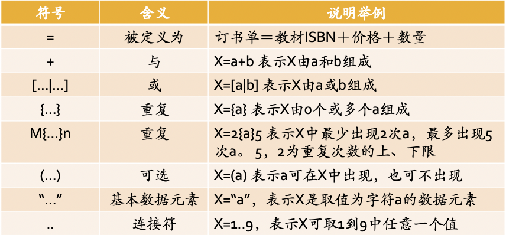
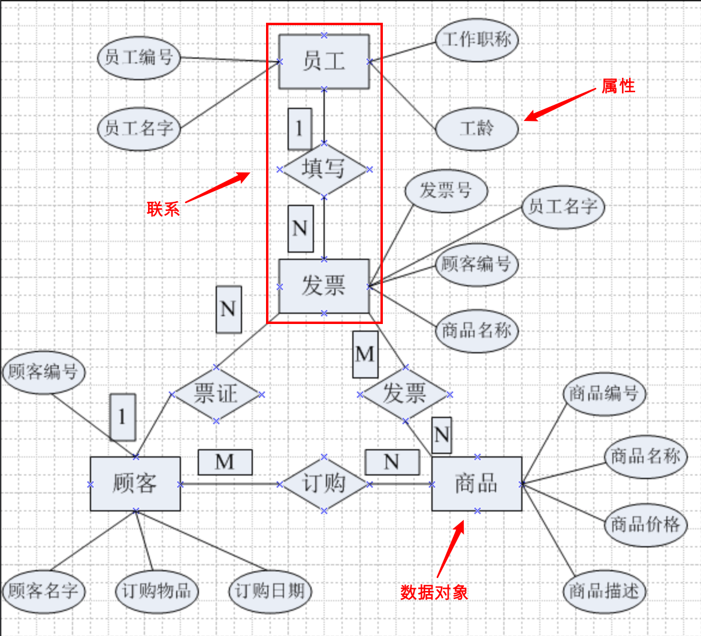
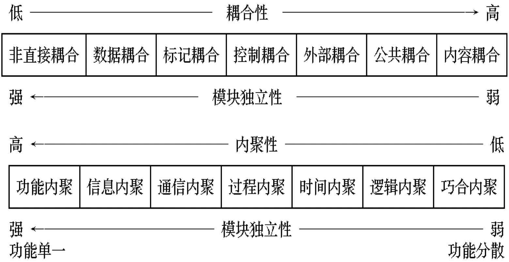
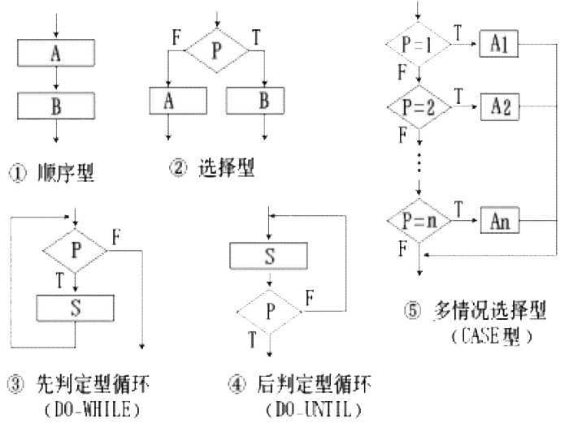
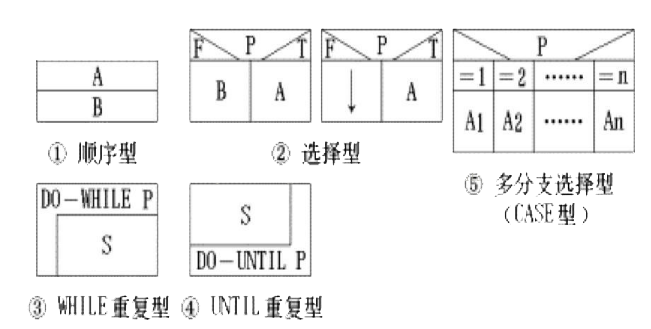
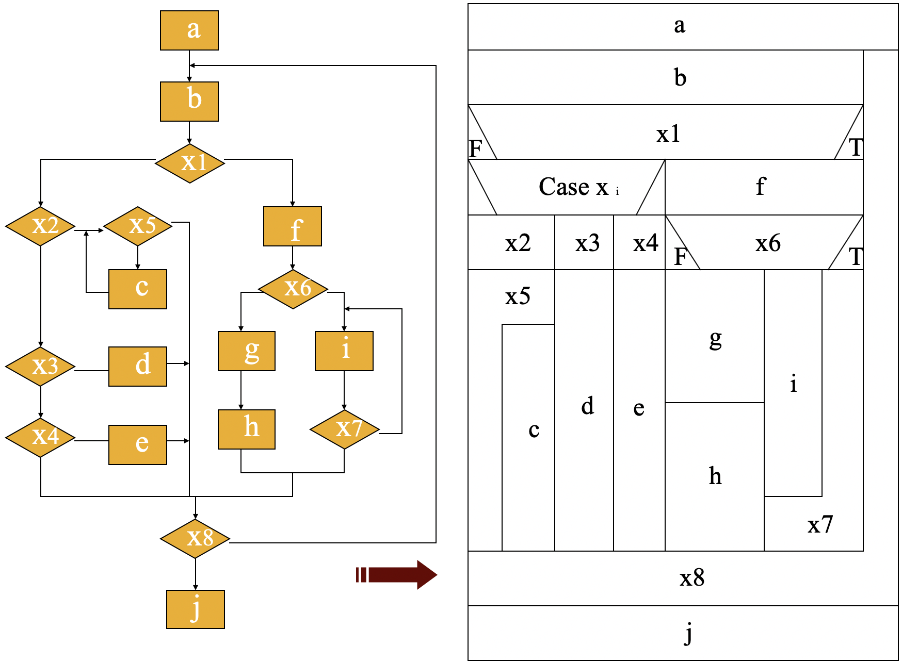
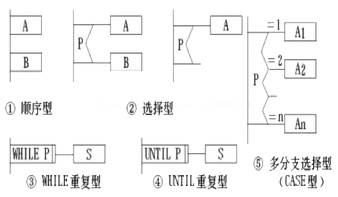
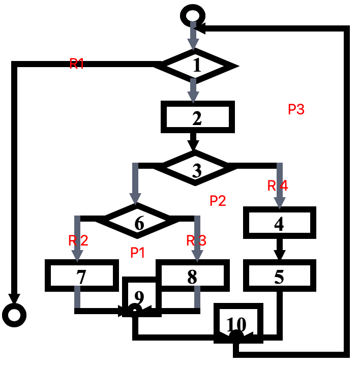
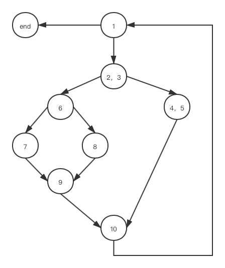
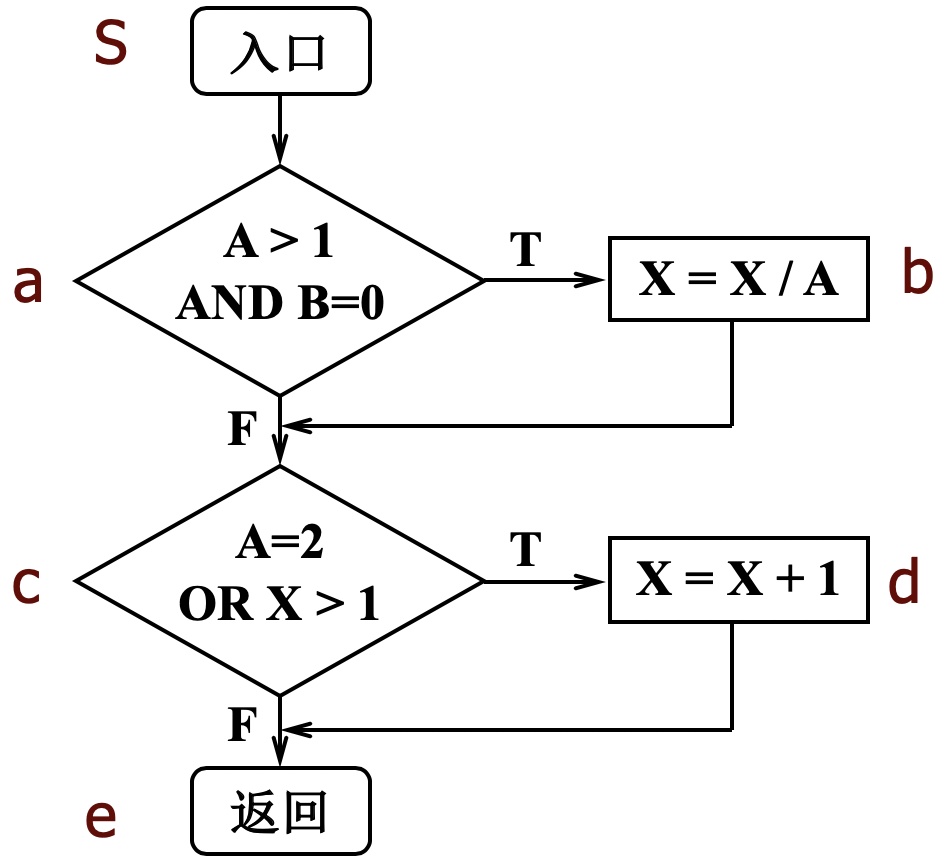

# 软件工程概述
> 软件危机是指在计算机软件的开发和维护过程中所遇到的一系列问题。
+ 软件是**程序、数据、文档**的完整集合
+ 软件工程方法学包括**方法、工具、过程**3大要素
+ 软件工程方法学:**传统方法学**和**面向对象方法学**
## 软件危机
1. 软件危机的定义:
    + 计算机软件的开发和维护过程中所遇到的一系列严重问题。
1. 与软件本身的特点有关
    + 逻辑部件，可见性差
    + 管理和控制软件开发很困难
    + 客观上软件维护比较困难
    + 需要人员协作和科学管理
2. 与软件开发与维护的方法不正确有关
    + 采用了错误的方法和技术
    + 忽视软件需求分析，过早编码
    + 轻视软件维护的重要性
3. 软件是有生命周期
    + 软件从定义、开发、使用、维护到终止的时期
    + 软件生命期中的有关经验数据
        + 编码通常占开发的10%～20%
        + 软件测试占开发的40%～50%
        + 设计错误占软件错误的63%，编码错误占37%
        + 软件维护费用占总投资的55%～70%
        + 软件后期变更比早期变更代价高
## 软件工程
1. 基本原理
    + 用分阶段的生命周期计划严格规划
    + 坚持进行阶段评审
    + 实行严格的产品控制
    + 采用现代程序设计技术
    + 结果应能清楚的审查
    + 开发小组的人员应该少而精
    + 承认不断改进软件工程实践的必要性
2. 本质特征
    + 软件工程关注于大型程序的构造
    + 软件工程中心课题是控制复杂性
    + 软件经常变化
    + 开发软件的效率非常重要
    + 和谐地合作是开发软件的关键
    + 软件必须有效地支持它的用户
    + 在软件工程领域中通常由具有一种文化背景的人替代另一种文化背景的人创造产品
3. 软件工程的定义:
    + 采用工程的概念、原理、技术和方法来开发与维护软件，把经过时间考验而证明正确的管理技术和当前能够得到的最好的技术方法结合起来，以经济地 **开发出高质量的软件(基本目标)** 并有效地维护。

## 软件生命周期
**软件生命周期3大时期、8大阶段**
+ 软件定义 **(1)**
    1. 问题定义：解决什么问题。
    2. 可行性研究
    3. 需求分析：产出**规格说明书**。
+ 软件开发 **(2)**
    
    4. 总体设计：目标系统必须具备的功能。
    5. 详细设计
    6. 编码和单元测试
    7. 综合测试
+ 软件维护 **(3)**

    8. 软件维护
    + 改正性维护
    + 适应性维护：适应系统变化。
    + 完善性维护：增加功能模块。
    + 预防性维护

## 软件过程(5大模型)
### 瀑布模型（文档驱动模型）
+ 特点 —— 缺乏灵活性
    1. 阶段间具有顺序性和依赖性
    2. 推迟实现的观点
    3. 清楚地区分逻辑设计与物理设计
+ 优点:
    + 可强迫开发人员采用规范的的方法。（规范化开发）
    + 严格地规定了每个阶段必须提交的文档。（阶段性文档）
    + 要求每个阶段交出的所有产品都必须经过质量保证小组的仔细检查。（有完备的后续检查）
+ 不足:完全依赖于书面的规格说明，可能导致产出的软件产品不能真正满足用户需要。
### 快速原型模型
>  适合于需求动态变化，事先难以确定系统（**不支持风险分析**）。


### 增量模型
+ 优点
    + 能在较短的时间内向用户提交可完成部分功能的产品。
    + 逐步增加产品功能可以使用户有较充裕的时间学习和适应。

### 螺旋模型
螺旋模型是**瀑布模型、原型模型**的有机结合，同时增加了风险分析。

> 适合于需求动态变化，事先难以确定并且**开发风险较大**的系统
+ 优点
    + 有助于获取用户需求，加强对需求的理解
    + 尽早发现软件中的错误
    + 支持需求的动态变化
    + 支持风险分析，可降低或者消除软件开发风险
+ 缺点
    + 过多的迭代次数会增加开发成本，延迟提交时间
    + 只适合大型软件项目的开发，否则，每个阶段的风险分析将占用很大一部分资源，增加成本
    + 对开发人员的风险分析能力是极大的考验

### 喷泉模型

---
# 可行性研究
## 可行性研究的任务
可行性研究的目的：确定问题是否值得去解决，包括：
+ 技术可行性
+ 经济可行性
+ 操作可行性
## 数据流图(DFD)
### 符号
+ 数据的源点/终点
+ 交换数据的处理
+ 数据存储
+ 数据流
+ （*）:表示数据流之间是“与”关系；
+ （+）:表示数据流之间是“或”关系；
+ （⊕）:表示只能从数据流中选一个(互斥关系)。

### 实例


### 原则
1. 确定系统的源点和终点
2. 确定系统的输入和输出数据流的关系
3. 保持分解前后输入/输出数据流必须相同(父子平衡)
4. 尽量简化加工之间的联系
5. 用“自顶向下”方法，逐层画出数据流图，每张数据流图中加工(处理)的个数不能超过9个(7加减2)
6. 注意分解速度(一般每分解一层增加2-7个加工)
7. 在画数据流图时应避免线条交叉，必要时可使用重复的外部项(源点或终点)或数据存储符号
8. 适当的命名，加工处理要编号

## 数据字典

> 用途:作为分析阶段的工具。
+ 组成:**(1)** 数据流;**(2)** 数据元素/数据流分量;**(3)** 数据存储;**(4)** 处理
## 成本/效益分析
+ 成本估算技术:**(1)** 代码行技术;**(2)** 任务分解技术;**(3)** 自动估计成本技术
---
# 需求分析
> 基本任务:准确地回答“系统必须做什么”的问题。
## 需求分析的任务
1. 确定对系统的综合要求
    + 功能需求
    + 性能需求
    + 可靠性和可用性需求
    + 出错处理需求
    + 接口需求
    + 约束
    + 逆向需求
    + 将来可能提出的需求
2. 分析系统的数据要求
3. 导出系统的逻辑模型
    + 数据流图/功能模型(DFD)
    + 数据字典(DD)
    + 实体-联系图/数据模型(ERD)**——实体、关系、属性**
    + 状态转化图/行为模型
4. 修正系统开发计划

+ 图形工具:层次方框图、Warnier图、IPO图

## 实体-联系图
1. 数据对象
2. 属性
3. 联系（1:1 / 1:n / m:n）


## 验证软件需求
### 软件需求正确性验证
1. 一致性
2. 完整性
3. 现实性
4. 有效性

---
# 总体设计
> 模块的作用域在控制域之内
## 设计原理
### 模块化
定义：把程序划分成独立命名且可独立访问的模块，每个模块完成一个子功能，把这些模块集成起来构成一个集体，可以完成指定的功能满足用户的需求。
### 模块独立（高内聚低耦合）

#### 耦合 —— 不同模块之间互联程度的度量。
> 使用规则：尽量使用数据耦合、少用控制耦合和特征耦合、限制公共环境耦合的范围、完全不用内容耦合。
> **低耦合:** 非直接耦合、数据耦合
> **中耦合:** 标记耦合、控制耦合、外部耦合、公共耦合
> **高耦合:** 内容耦合

+ 内容耦合：一个模块直接影响另一个模块，调用或操纵其他模块的数据。
+ 公共耦合：几个模块共享一个数据区域。

+ 特征耦合：把整个数据结构作为参数传递而被调用模块只使用其中一部分数据元素时就出现了特征耦合。
+ 控制耦合：一个模块通过传递控制信息来控制另一个模块。
+ 标记耦合: 模块间通过参数表传递记录信息，这个记录是某一数据结构的子结构，而不是简单变量
+ 数据耦合: 只有数据在模块之间进行交换，只通过参数传递基本类型的数据
+ 非直接耦合: 两个模块之间没有直接关系，它们之间的联系完全是通过主模块的控制和调用来实现的

#### 内聚 —— 模块内各个元素彼此结合的紧密程度。
> **低内聚:** 偶然内聚、时间内聚、逻辑内聚
> **中内聚:** 过程内聚、通信内聚
> **高内聚:** 顺序内聚、功能内聚
+ 偶然内聚：如果一个模块完成一组任务，这些任务彼此间即使有关系，关系也是很松散的。
+ 逻辑内聚：如果一个模块完成的任务在逻辑上属于相同或相似的一类，由参数决定模块执行的功能。
+ 时间内聚：如果一个模块包含的任务必须在同一段时间内执行。
+ 过程内聚：如果一个模块内的处理元素是相关的而且以特定次序执行。
+ 通信内聚：如果模块中所有元素都使用同一个输入数据和(或)产生同一个输出数据。
+ 顺序内聚：一个处理元素的输出数据作为下一个处理元素的输人数据。
+ 功能内聚：如果模块内所有处理元素属于一个整体，完成一个单一的功能。

1. 深度:软件结构中控制的层数
2. 宽度:软件结构中同一个层次上的模块数量。
3. 扇入:上级模块调用数量。
4. 扇出:调用的模块数量。(通常为3～4,上限为5～9)
---
# 详细设计
+ 基本控制结构: **(1)** 顺序 **(2)** 选择 **(3)** 循环
## 过程设计的工具
### 程序流程图
+ **五种基本控制结构**
    

### 盒图(N-S图)
+ **五种基本控制结构**
    
+ **范例**


### PAD图(问题分析图)
+ **五种基本控制结构**
    
+ **范例**


### 判定树/表
清晰表达复杂条件组合和应做的动作之间的关系

## 面向数据结构的设计方法
### Jackson图
+ 顺序结构
```bash
A seq
  B
  C
  D
A end
```
+ 选择结构(右上角标识一个**圆圈**)
```bash
A select cond1
  B
A select cond2
  C
A end
```
+ 重复结构(右上角标识一个**星号**)
```bash
A iter while cond
  B
A end
```
#### 范例

```bash
统计空格 seq
    打开文件(2)
    读入字符串(9)
    totalsum := 0(11)
    程序体 iter until 文件结束(I1)
        处理字符串 seq
            印字符串 seq
                印出字符串(4)
            印字符串 end
            sum:=0(10)
            pointer:=1(12)
            分析字符串 iter until 字符串结束(I2)
                分析字符 select 字符是空格(S3)
                    处理空格 seq
                        sum:=sum+1(7)
                        pointer:=pointer+1(13)
                    处理空格end
                分析字符 or 字符不是空格
                    处理非空格 seq
                        pointer:=pointer+1(13)
                    处理非空格end
                分析字符end
            分析字符串 end
            印空格数seq
                印出空格数目(5)
            印空格数end
            totalsum:=totalsum+sum(8)
            读入字符串(9)
        处理字符串end
    程序体end
    印总数seq
      印出空格总数(6)
    印总数end
    关闭文件(3)
    停止(1)
统计空格end
```

## 程序复杂程度的定量度量
### McCabe方法
**3种计算方法:**
> 需要现转化为流图
+ 流图中的区域数等于环形复杂度。  (所有完整的路数)
+ 流图G的环形复杂度V(G)＝E-N+2，其中，E是流图中边的条数，N是结点数。
+ 流图G的环形复杂度V(G)＝P+1，其中，户是流图中判定结点的数目。



**转化为流图**


**对应的三种计算过程：**
E＝11,N＝9
(1) V(G)=R1+R2+R3+R4=4
(2) V(G)=E-N+2=4
(3) V(G)=P1+P2+P3+1=4

# 实现
## 软件测试基础
+ 软件测试的目的：尽可能多地发现并排除软件中潜藏的错误，最终把一个高质量的软件系统交给用户使用。
+ 软件测试4个步骤:**(1)** 模块测试/单元测试 **(2)** 子系统测试/集成测试 **(3)** 系统测试 **(4)** 验收测试 **(5)** 平行运行
## 单元测试、集成测试、确认测试

## 白盒测试
+ 语句覆盖 —— 每个语句至少执行一次
+ 判定覆盖 —— 在语句覆盖基础上，每个判定的**每个分支**至少执行一次
+ 条件覆盖 —— 在语句覆盖基础上，使每个判定表达式的**每个条件都取到**各种可能的结果
+ 判定／条件覆盖 —— 使得判定表达式中的每个条件都取到各种可能的值，而且每个判定表达式也都取到各种可能的结果
+ 条件组合覆盖 —— 使得每个判定表达式中条件的各种可能组合都至少出现一次(测试的数量=$2^n$ (其中n=需要判定的数量))
+ 路径覆盖 —— 每条可能的路径都至少执行一次，若图中有环，则每个环至少经过一次
+ 路径覆盖 ^ 条件组合覆盖

> 判定覆盖和条件覆盖的区别实例:
> 
> 满足了**条件覆盖**，但是没有满足**判定覆盖**
> + ①A=2, B=0, X=1 (路径：sabcde)
> + ②A=1, B=1, X=2 (路径：sacde)

## 黑盒测试
+ 等价划分 —— 划分一组**等价类**描绘一组输入条件的有效或无效条件, 测试程序是否有设计方案中该有的输出结果。
+ 边界值分析 —— 选取刚好等于、稍小于和稍大于**等价类边界值**的数据作为测试数据。
+ 错误推测

## 调试
1. 蛮干法
2. 回溯法
3. 原因排查法 $\supset$ 对分查找法、归纳法、演绎法

# 维护
1. **什么是软件维护？**
在软件已经交付使用之后，为了改正错误或满足新的需要而修改软件的过程。

2. **软件维护做什么？**
    + 改正性维护 —— 诊断和改正错误 
    + 适应性维护 ——为了和变化了的环境（如软\硬件升级、新数据库等）适当地配合而修改软件
    + 完善性维护 —— 修改软件。**占主要地位！！！**
    + 预防性维护 —— 为了改进未来的可维护性或可靠性，或为了给未来的改进奠定更好的基础而修改软件 
3. **如何降低维护的成本/进行有效的维护？**
    + 建立一个维护组织。
    + 确定报告和评价的过程。
    + 为每个维护要求规定一个标准化的事件序列。
    + 建立一个适用于维护活动的记录保管过程，并且规定复审标准。
4. 决定软件可维护性的5大因素：
    + 可理解性
    + 可测试性
    + 可修改性
    + 可移植性
    + 可重用性
5. 文档
    + 用户文档
    + 系统文档

# 面向对象方法学引论
1. 三大特性
    + 封装:数据和实现操作的代码集中起来放在对象内部。
    + 继承:子类自动共享基类中定义的数据和方法。
    + 多态:动态选用在该类中定义的方法。
2. UML
    + 关联
    + 聚集:**(1)** 共享聚集;**(2)** 组合聚集
    + 泛化:继承/实现
    + 依赖和细化